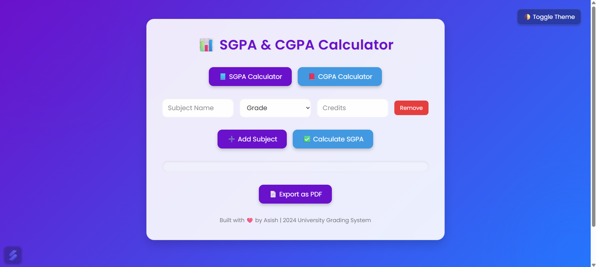

# 🎓 SGPA & CGPA Calculator (2024 Batch)

A responsive, modern web application to help university students calculate their **SGPA** (Semester Grade Point Average) and **CGPA** (Cumulative Grade Point Average). Built using **HTML, CSS, and JavaScript** with a clean and animated user interface supporting dark/light mode and export options.

🌐 **Live Website:** [https://nist-sgpa-cgpa-calculator.netlify.app/](https://nist-sgpa-cgpa-calculator.netlify.app/)

---

## 📌 Who Can Use This?
This calculator is designed for **university students using the 10-point grading system**. You can use it if your institution awards grades like A+, A, B+, B, etc., with corresponding grade points (10.0 to 0.0). 

### 🎓 Grade Mapping Used
| Grade | Range       | Grade Point |
|-------|-------------|--------------|
| A+    | 90 - 100    | 10.0         |
| A     | 80 - 89     | 9.0          |
| B+    | 70 - 79     | 8.0          |
| B     | 60 - 69     | 7.0          |
| C+    | 50 - 59     | 6.0          |
| C     | 45 - 49     | 5.0          |
| D     | 40 - 44     | 4.0          |
| F     | Below 40    | 0.0          |

---

## ✨ Features
- 📘 SGPA calculation (subject-wise input)
- 📕 CGPA calculator (multiple semester SGPAs)
- 🌗 Dark/light theme toggle
- 📄 Export results as PDF
- ✅ Input validation for grade and credit fields
- 💡 Smooth UI with animated gradient backgrounds
- 📱 Fully responsive (works on mobile too)

---

## 📷 Preview


---

## 🚀 How to Use

1. **Clone the repository:**
```bash
git clone https://github.com/Asish-own/sgpa-cgpa-calculator.git
cd sgpa-cgpa-calculator
```

2. **Open `index.html` in your browser**
```bash
start index.html
```

---

## 🧠 Tech Stack
- HTML5
- CSS3 (Glassmorphism, Animations, Media Queries)
- JavaScript (DOM manipulation, Validation, PDF Export)

---

## 📁 Project Structure
```
.
├── assets/
│   └── icon.png          # Website favicon
├── index.html            # Main HTML file
├── style.css             # All UI styles and theme support
├── script.js             # Core calculator logic
└── README.md             # Project documentation
```

---

## 🤝 Contributing
We welcome contributions! Here’s how you can help:
1. Fork the repository
2. Create a new branch (`feature/YourFeatureName`)
3. Commit your changes
4. Open a pull request

---

## 📜 License
This project is licensed under the [MIT License](LICENSE).

---

## 🙏 Acknowledgements
Made with ❤️ by **Asish Kumar Behera**, using guidance and support from **ChatGPT by OpenAI**.

---
